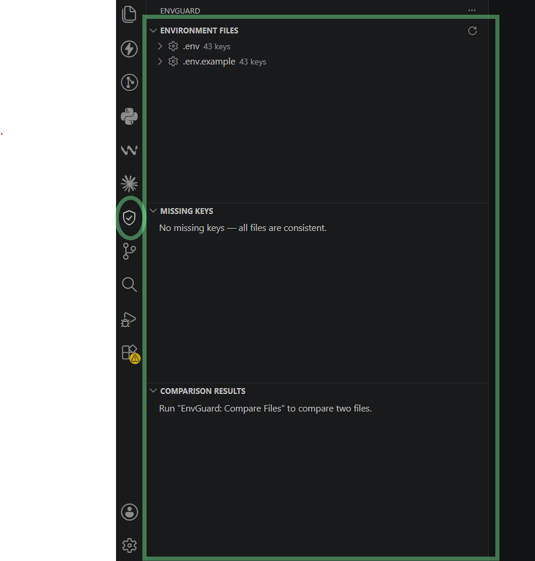
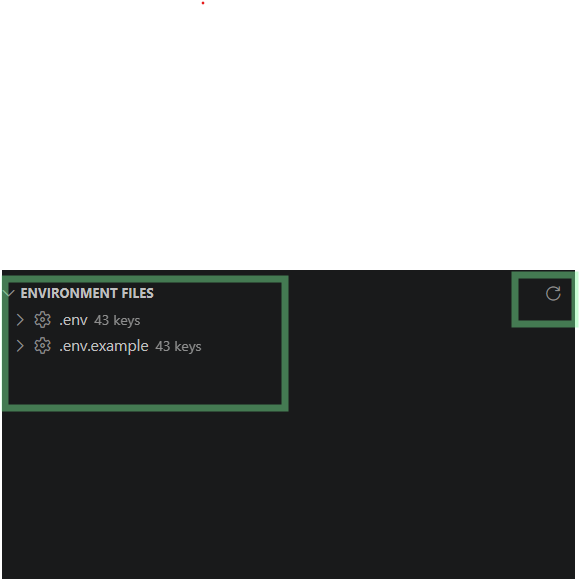
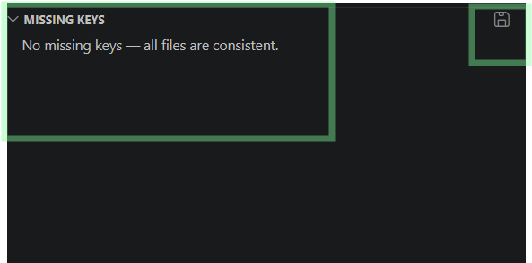
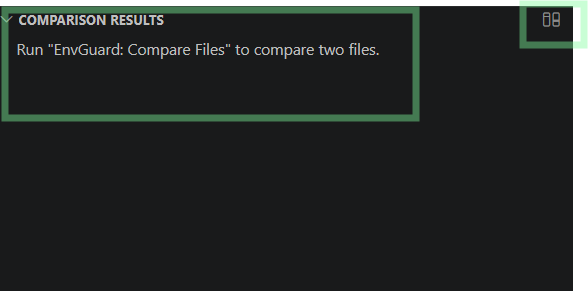

# EnvGuard

Framework-agnostic environment file manager for VS Code. Discover, parse, compare, and audit configuration files across Laravel, Node.js, Express, NestJS, Next.js, React, Vue, Spring Boot, Django, Flask, Rails, Go, and .NET projects.

Everything runs locally. No telemetry, no network calls, no accounts.

## This is the view after the extension






## Features

- **Environment File Discovery** — finds `.env`, `.env.*` (local/development/production/staging/test/example/…), `application*.properties`, and `application*.yml|yaml` anywhere in the workspace, skipping `node_modules`, `vendor`, build output, and virtualenvs.
- **Unified parsing** — dotenv, Java properties, and YAML files all normalize to flat `key = value` entries. Nested YAML flattens to dotted keys (`spring.datasource.url`), so a Spring config is directly comparable to a properties file.
- **Comparison Tool** — pick any two files (e.g. `.env.example` vs `.env`) and get missing keys, extra keys, and value differences in the sidebar plus a full report panel.
- **Missing Key Detector** — audits all files of the same format against each other and flags keys that some environments define and others lack (e.g. `APP_KEY` present in `.env` but missing from `.env.production`).
- **Export Report** — writes `report.json` (missing keys, extra keys, differences) to the workspace root.
- **Click-to-navigate** — every key in every view opens its file at the exact line.

## Commands

| Command | What it does |
| --- | --- |
| `EnvGuard: Scan Environment Files` | Discover files, run the missing-key audit, refresh the sidebar |
| `EnvGuard: Compare Files` | Pick a base and target file, see the diff |
| `EnvGuard: Refresh` | Silent re-scan (also the ↻ button on the Environment Files view) |
| `EnvGuard: Export Report` | Write `report.json` to the workspace root |

## Getting started (development)

```bash
npm install
npm run compile
```

Press **F5** in VS Code to launch the Extension Development Host, then open the bundled `sample-workspace/` folder — it contains deliberate inconsistencies that exercise every feature.

Run the logic smoke tests (no VS Code required):

```bash
node scripts/smoke-parsers.js
```

## Architecture

```
src/
├── extension.ts      # Composition root — the only file that wires concrete classes
├── types/            # Service contracts (IEnvParser, IComparisonService, …)
├── models/           # Pure data shapes (EnvEntry, ComparisonResult, …)
├── parsers/          # ALL format knowledge: DotEnvParser, PropertiesParser, YamlParser
├── services/         # Discovery, parsing facade, comparison, reports, tree state
├── commands/         # Thin orchestrators bound by CommandRegistrar
├── tree/             # Three TreeDataProviders (pure renderers)
├── views/            # ComparisonPanel webview (scripts disabled)
└── utils/            # Small shared helpers
```

Rules the codebase follows:

- Commands contain no business logic — they call services and push results into views.
- Parsing logic lives only in `parsers/`; comparison logic only in `ComparisonService`.
- Pure logic (`parsers`, `ComparisonService`, `EnvironmentParserService`, `reportBuilder`) never imports `vscode`, so it is testable in plain Node.
- Dependency injection happens once, by hand, in `extension.ts`.


## License

MIT
